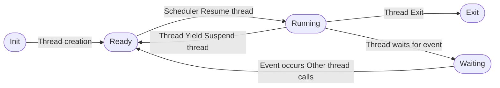

Lab 1: Threads
===
김민석 (20180174), 권민재 (20190084) `CSED312`


# Introduction

## Background

 Thread(이하 '스레드')는 어떤 프로세스 안에서의 실행 단위라고 말할 수 있다. 한 프로세스는 여러 스레드를 가질 수 있으며, 이들은 동시에 실행될 수도 있다. 하지만, CPU의 자원은 한정적이기 때문에 무한한 스레드들이 동시에 실행될 수는 없다. 즉, 추상적으로는 각 스레드들이 동시에 실행되는 것처럼 보이더라도, 이들은 우선순위를 가지고 순서에 따라 실행될 수 밖에 없다.


 각 스레드는 특별한 lifecycle(이하 '생명주기')를 가진다. 스레드가 일단 생성되면 준비 상태가 되며, 실행할 수 있는 상태가 되었을 때 비로소 실행을 할 수 있게 된다. 이후 동작에 따라 스레드는 종료되거나, 대기 상태에 빠지게 된다. 대기 상태에 빠진 스레드는 이후 OS에 의해 일정 조건이 만족되었을 때 다시 준비 상태가 된다. 
 
 이번 과제에서는 Pintos에서 스레드의 생명 주기를 관리하고, 스레드를 스케쥴링 하는 방법에 대해서 알아볼 것이다.


## Structures

### 1. Priority

```c 
// File: threads/thread.h
/* Thread priorities. */
#define PRI_MIN 0                       /* Lowest priority. */
#define PRI_DEFAULT 31                  /* Default priority. */
#define PRI_MAX 63                      /* Highest priority. */
```

스레드가 가질 수 있는 최소, 최대, 기본 우선 순위를 정의해두었다. Pintos에서는 64단계의 우선 순위 단계가 존재하며, 기본 우선 순위 단계는 그 값으로 31을 가진다.


### 2. Thread Status

```c
// File: threads/thread.h
enum thread_status
  {
    THREAD_RUNNING,     /* Running thread. */
    THREAD_READY,       /* Not running but ready to run. */
    THREAD_BLOCKED,     /* Waiting for an event to trigger. */
    THREAD_DYING        /* About to be destroyed. */
  };
```

 앞서 배경에서 언급한 것과 같이, 각 스레드는 생명주기에 따른 상태를 가진다. 이들은 `thread.h` 에 이미 열거형으로 선언되어 있다. `THREAD_RUNNING`은 스레드가 실행중임을 나타내며, `THREAD_READY`는 스레드가 대기 중임을 나타낸다. `THREAD_BLOCKED`는 스레드가 블록되어 실행이 멈춰진 상태를 의미하며, `THREAD_DYING`는 실행이 종료되었음을 뜻한다. 이 값은 곧 살펴볼 `Thread` 구조체에 포함되어 스레드의 상태를 나타내는데 이용될 것이다.


### 3. Thread

```c
// File: threads/thread.h
struct thread
  {
    /* Owned by thread.c. */
    tid_t tid;                          /* Thread identifier. */
    enum thread_status status;          /* Thread state. */
    char name[16];                      /* Name (for debugging purposes). */
    uint8_t *stack;                     /* Saved stack pointer. */
    int priority;                       /* Priority. */
    struct list_elem allelem;           /* List element for all threads list. */

    /* Shared between thread.c and synch.c. */
    struct list_elem elem;              /* List element. */

    // ...

    /* Owned by thread.c. */
    unsigned magic;                     /* Detects stack overflow. */
  };
```
각 스레드는 기본적으로 스레드 식별자<sub>`tid`</sub>와 상태<sub>`status`</sub>, 그리고 이름<sub>`name`</sub>을 가진다. 또한, 스레드의 스택을 관리하기 위한 스레드 스택 포인터 <sub>`stack`</sub>과 모든 스레드의 목록을 관리하는 리스트의 원소로서 관리되기 위해 `allelem`을 가지고 있다. `elem` 또한 이와 유사한 역할을 하는데, 대기 중인 스레드 리스트나 현재 실행 중인 스레드 리스트의 원소로서 관리되기 위해 추가되어 있다. 마지막으로, 스레드 스택이 TCB를 덮는 것을 방지하기 위한 `magic` 필드가 존재한다. Stack canary와 비슷한 역할을 하는 것으로 해석된다.


## Algorithms

### 1. Create

```c
// File: threads/thread.h
tid_t
thread_create (const char *name, int priority,
               thread_func *function, void *aux) 
{
  struct thread *t;
  struct kernel_thread_frame *kf;
  struct switch_entry_frame *ef;
  struct switch_threads_frame *sf;
  tid_t tid;

  ASSERT (function != NULL);

  /* Allocate thread. */
  t = palloc_get_page (PAL_ZERO);
  if (t == NULL)
    return TID_ERROR;

  /* Initialize thread. */
  init_thread (t, name, priority);
  tid = t->tid = allocate_tid ();

  /* Stack frame for kernel_thread(). */
  kf = alloc_frame (t, sizeof *kf);
  kf->eip = NULL;
  kf->function = function;
  kf->aux = aux;

  /* Stack frame for switch_entry(). */
  ef = alloc_frame (t, sizeof *ef);
  ef->eip = (void (*) (void)) kernel_thread;

  /* Stack frame for switch_threads(). */
  sf = alloc_frame (t, sizeof *sf);
  sf->eip = switch_entry;
  sf->ebp = 0;

  /* Add to run queue. */
  thread_unblock (t);

  return tid;
}
```
 스레드를 만드는 과정은 크게 2부분으로 구성되어 있다. 우선, 스레드를 생성할 때 스레드를 위한 메모리를 할당하고 스택 프레임을 구성한다. 이것은 기본적인 실행을 준비하기 위함이다. 이 과정이 지나면, `thread_unblock (t)`을 통해 이 스레드를 `ready_list`에 추가하게 된다.


### 2. Scheduling

#### 2.1. Main Routine

```c
static void
schedule (void) 
{
  struct thread *cur = running_thread ();
  struct thread *next = next_thread_to_run ();
  struct thread *prev = NULL;

  ASSERT (intr_get_level () == INTR_OFF);
  ASSERT (cur->status != THREAD_RUNNING);
  ASSERT (is_thread (next));

  if (cur != next)
    prev = switch_threads (cur, next);
  thread_schedule_tail (prev);
}
```
`schedule()`은 `thread_block()`, `thread_exit()`, `thread_yield()`에서 호출되어 스레드를 스케쥴링하는데 쓰이게 된다. 이 함수가 불리면 다음 스레드로 스위칭한 다음, `thread_schedule_tail()`를 통해 각 스레드의 상태를 변경하게 된다.

```c 
void
thread_schedule_tail (struct thread *prev)
{
  struct thread *cur = running_thread ();
  
  ASSERT (intr_get_level () == INTR_OFF);

  /* Mark us as running. */
  cur->status = THREAD_RUNNING;

  /* Start new time slice. */
  thread_ticks = 0;

#ifdef USERPROG
  /* Activate the new address space. */
  process_activate ();
#endif

  /* If the thread we switched from is dying, destroy its struct
     thread.  This must happen late so that thread_exit() doesn't
     pull out the rug under itself.  (We don't free
     initial_thread because its memory was not obtained via
     palloc().) */
  if (prev != NULL && prev->status == THREAD_DYING && prev != initial_thread) 
    {
      ASSERT (prev != cur);
      palloc_free_page (prev);
    }
}
```
`thread_schedule_tail()`은 `schedule()`의 가장 마지막에 호출되어, 스위칭되어 곧 실행될 스레드와 이전 스레드의 상태를 변경하게 된다. 우선, 곧 실행될 스레드를 가져와서 해당 스레드의 상태를 실행 중인 상태로 변경한다. 이때, 타이머 틱 또한 초기화하게 된다. 이후, 이전 스레드가 만약 종료된 상태라면, 해당 스레드에 할당된 페이지를 해제하는 역할까지 수행하게 된다.


#### 2.2. Managing Lifecycle

```c
void
thread_unblock (struct thread *t) 
{
  enum intr_level old_level;

  ASSERT (is_thread (t));

  old_level = intr_disable ();
  ASSERT (t->status == THREAD_BLOCKED);
  list_push_back (&ready_list, &t->elem);
  t->status = THREAD_READY;
  intr_set_level (old_level);
}
```

특정 스레드를 unblocking 하는 과정은 blocking된 스레드의 상태를 준비된 상태로 바꿔주고, `ready_list`의 맨 뒤에 붙임으로써 구현된다. 레이스 컨디션을 방지하기 위해 인터럽트를 꺼주어야 한다.

```c
void
thread_yield (void) 
{
  struct thread *cur = thread_current ();
  enum intr_level old_level;
  
  ASSERT (!intr_context ());

  old_level = intr_disable ();
  if (cur != idle_thread) 
    list_push_back (&ready_list, &cur->elem);
  cur->status = THREAD_READY;
  schedule ();
  intr_set_level (old_level);
}
``` 

현재 실행중인 스레드를 yield 하는 과정은 특정 스레드를 unblock하는 과정과 비슷하다. 결국 스레드를 `ready_list`에 넣는 과정에 해당하기 때문이다. 다만, IDLE 스레드의 경우에는 `ready_list`에 넣지 말아야 한다는 점과, 현재 실행 중인 스레드를 수정하는 것이기 때문에 `schedule()`을 호출해줘야 한다는 점에서 차이가 있다. 레이스 컨디션을 방지하기 위해 인터럽트를 꺼주어야 한다.

```c
void
thread_block (void) 
{
  ASSERT (!intr_context ());
  ASSERT (intr_get_level () == INTR_OFF);

  thread_current ()->status = THREAD_BLOCKED;
  schedule ();
}
```

스레드를 blocking 해야할 때는 단순히 현재 스레드의 상태를 바꿔준 이후, `schedule()` 함수를 통해 다음 스레드로 바꿔주기만 하면 된다.


### 3. Exit
 
```c
// File: threads/thread.h
void
thread_exit (void) 
{
  ASSERT (!intr_context ());

#ifdef USERPROG
  process_exit ();
#endif

  /* Remove thread from all threads list, set our status to dying,
     and schedule another process.  That process will destroy us
     when it calls thread_schedule_tail(). */
  intr_disable ();
  list_remove (&thread_current()->allelem);
  thread_current ()->status = THREAD_DYING;
  schedule ();
  NOT_REACHED ();
}
```

스레드가 종료되는 과정은 꽤나 간단한 편이다. 모든 스레드의 목록에서 현재 스레드를 제거하고, 현재 스레드의 상태를 `THREAD_DYING`로 지정한다. 이후, `schedule()`을 호출하면, `thread_schedule_tail()`에 의해 페이지의 할당이 해제되어 스레드가 완전히 삭제된다. 이것은 스레드의 상태를 `THREAD_DYING`으로 지정하였기 때문에 가능한 일이다. 이때, 의도치 않은 레이스 컨디션을 막기 위해, `intr_disable()`를 통해 인터럽트를 끄는 과정이 포함되어 있음을 양지해야 한다.


### 4. Synchronization

#### 4.1. Semaphore

```c 
void
sema_down (struct semaphore *sema) 
{
  enum intr_level old_level;

  ASSERT (sema != NULL);
  ASSERT (!intr_context ());

  old_level = intr_disable ();
  while (sema->value == 0) 
    {
      list_push_back (&sema->waiters, &thread_current ()->elem);
      thread_block ();
    }
  sema->value--;
  intr_set_level (old_level);
}
```
`sema_down()`은 현재 스레드가 공유된 자원을 이용하기 위해 호출하게 되는 함수이다. 세마포어가 0이 되면, 더 이상 자원을 공유할 수 있다는 뜻이 아니므로, 해당 상황에서는 스레드들을 세마포어의 `waiters` 목록에 추가시키고 블록시킨다. 공유된 자원을 이용함에 따라, 세마포어의 값을 1 줄여준다. 이 과정에서도 인터럽트가 꺼져있어야 함을 명심하자.

```c 
void
sema_up (struct semaphore *sema) 
{
  enum intr_level old_level;

  ASSERT (sema != NULL);

  old_level = intr_disable ();
  if (!list_empty (&sema->waiters)) 
    thread_unblock (list_entry (list_pop_front (&sema->waiters),
                                struct thread, elem));
  sema->value++;
  intr_set_level (old_level);
}
```

`sema_up()`은 현재 스레드가 공유된 자원의 이용을 끝냈음을 알리기 위해 호출되는 함수이다. 공유된 자원의 이용이 끝났으므로, 이 자원을 이용하고자 하는 다른 스레드가 자원을 이용할 수 있도록 만들어줘야 한다. 이를 위해 `waiters`의 가장 앞에 있는 스레드를 unblock 시켜준다. 이후 세마포어의 값을 1 올려줌으로써 세마포어를 up 시킬 수 있다. 물론, 이 과정에서도 인터럽트는 꺼져있어야 한다. 


#### 4.2. Lock

```c
struct lock 
  {
    struct thread *holder;      /* Thread holding lock (for debugging). */
    struct semaphore semaphore; /* Binary semaphore controlling access. */
  };
```

Pintos에서 락은 세마포어의 특별한 형태로 구현되어 있다. `Lock` 구조체는 Value가 1인 세마포어, 즉 자원을 한번에 이용할 수 있는 스레드의 수를 1로 제한시킨 형태의 세마포어와 그에 상응하는 스레드의 포인터로 구성되어 있다. 이러한 락은 앞서 소개한 `sema_down()`과 `sema_up()`을 통해 그 역할이 실현된다.

```c 
void
lock_acquire (struct lock *lock)
{
  ASSERT (lock != NULL);
  ASSERT (!intr_context ());
  ASSERT (!lock_held_by_current_thread (lock));

  sema_down (&lock->semaphore);
  lock->holder = thread_current ();
}
```

현재 스레드가 lock을 요청하면, `sema_down()`을 이용하여 해당 lock의 세마포어를 down 시킨다. 이때, 이 세마포어의 value는 1이므로, lock의 역할을 수행하게 된다. 또한, lock의 holder를 현재 스레드로 설정한다.

``` c
void
lock_release (struct lock *lock) 
{
  ASSERT (lock != NULL);
  ASSERT (lock_held_by_current_thread (lock));

  lock->holder = NULL;
  sema_up (&lock->semaphore);
}
```

현재 스레드가 lock을 풀면, `sema_up()`을 이용하여 해당 lock의 세마포어를 up 시킨다. 또한, lock의 holder를 비워준다.


# Alarm Clock

## Problem Description

Pintos의 기본 `timer_sleep()`은 **busy wait**로 구현되어 있다. Busy wait를 이용하면 락이나 세마포어 없이 스레드 간의 전환을 할 수 있기에, 해당 기법들의 오버헤드가 큰 상황에서는 비교적 이점을 가진다고 말할 수 있다. 하지만, pintos에서는 스레드 간의 잠금에 걸리는 오버헤드가 크리티컬 패스라고 말할 수 없기 때문에, busy wait를 이용하는 것은 비효율적이며, 오히려 sleep 해야할 스레드를 깨우는 과정이 동반되어 자원이 낭비된다. 그렇기 때문에, CPU 자원 낭비를 줄이기 위해 busy wait 하지 않도록 수정해야 한다.


## Analysis

```c
// File: devices/timer.c
/* Sleeps for approximately TICKS timer ticks.  Interrupts must
   be turned on. */
void
timer_sleep (int64_t ticks) 
{
  int64_t start = timer_ticks ();

  ASSERT (intr_get_level () == INTR_ON);
  while (timer_elapsed (start) < ticks) 
    thread_yield ();
}
```
```c
// File: thread/thread.c
/* Yields the CPU.  The current thread is not put to sleep and
   may be scheduled again immediately at the scheduler's whim. */
void
thread_yield (void) 
{
  struct thread *cur = thread_current ();
  enum intr_level old_level;
  
  ASSERT (!intr_context ());

  old_level = intr_disable ();
  if (cur != idle_thread) 
    list_push_back (&ready_list, &cur->elem);
  cur->status = THREAD_READY;
  schedule ();
  intr_set_level (old_level);
}
```

Pintos에 구현된 `timer_sleep()`은 while문의 `thread_yield()`을 통해 현재 스레드를 `ready_list` 끝에 삽입한다. 즉, 해당 스레드가 awake 하기 전까지는 실행될 필요가 없음에도 불구하고, `ready_list`에 추가되고 있는 것이다. `ticks`가 지나기 전 다시 while문을 실행하는 의미없는 context switch(`ready`->`running`->`ready`)가 발생할 수 있는 **busy waiting**이다


## Solution

### Data Structures

#### 1. Sleep List

```c
static struct list sleep_list; 
```
`THREAD_BLOCKED` 상태인 스레드들을 관리하기 위한 리스트를 추가한다.


#### 2. Awake Tick

```c
// File: threads/thread.h
struct thread
  {
    // ...
    int64_t awake_tick;
    // ...
  };
```
스레드가 일어나야할 틱을 저장하기 위해, 스레드 구조체에 해당 값을 저장할 수 있는 필드를 추가한다.


### Algorithms

#### 1. Init thread system

```c 
void
thread_init (void) 
{
  // ...
  
  list_init (&sleep_list);
  
  // ...
}
```
스레드 시스템이 초기화될 때, 앞서 선언한 `sleep_list` 또한 초기화될 수 있도록 해야한다.


#### 2. Sleep thread

```c
void
thread_sleep (int64_t ticks)
{
  // 1. 레이스 컨디션 방지를 위한 인터럽트 해제
  // 2. 현재 스레드의 awake_tick을 ticks로 설정
  // 3. thread_block() 호출; 스레드 블록시킴
  // 4. sleep_list에 list_insert_ordered()를 이용하여 스레드를 추가
  //    이때, awake_tick이 작은 순서대로 정렬한다.
  // 5. 인터럽트 설정
}
```
`timer_sleep()`에 의해 스레드가 sleep 상태로 전환되어야 할때, 스레드를 올바르게 sleep 시키기 위해 위와 같은 로직을 설계해야 한다.

```c
void
timer_sleep (int64_t ticks) 
{
  // ...
  // Busy waiting 로직 삭제
  thread_sleep(start + ticks)
}
```
이후, 기존 `timer_sleep()`에 존재하던 **busy waiting** 로직을 삭제하고, 앞서 설계한 `thread_sleep()`을 호출하도록 하여 스레드를 잠재울 수 있도록 한다.


#### 3. Awake thread

```c 
void
thread_awake (int64_t ticks)
{
  // 1. sleep_list를 순회한다. 현재 조회 중인 스레드를 t라고 하자.
  //     a. t의 awake_tick이 ticks 보다 작다면, 
  //         - t를 sleep_list에서 삭제한다.
  //         - thread_unblock(t)를 통해 unblock 시킨다.
  //         - Recall. thread_unblock()은 스레드를 ready_list에 넣어준다.
  //     b. t의 awake_tick이 ticks 보다 크거나 같다면,
  //         - 반복을 종료한다. sleep_list가 정렬되어 있기 때문이다.
}
```

타이머 틱마다 `sleep_list`에 있는 스레드들 중에서 awake 해야하는 스레드들을 깨우기 위해서, 위와 같은 `thread_awake()` 함수를 설계했다. 해당 함수는 `timer_interrupt()`에서 호출되어, 각 인터럽트마다 깨어나야하는 스레드들을 awake하게 만들 것이다.

``` c 
static void
timer_interrupt (struct intr_frame *args UNUSED)
{
  // ...
  thread_awake(ticks);
}
```
`timer_interrupt()`에서 `thread_awake()`를 호출하여 awake해야할 스레드들이 `ready_list`로 이동할 수 있도록 만든다.


# Priority Scheduling

## Problem Description

Pintos에서 새로운 스레드와 `ready` 상태로 전환되는 스레드는 우선 순위에 상관 없이 `ready_list`의 끝에 삽입된다. 스레드의 우선 순위를 구현해 높은 우선 순위의 스레드가 먼저 스케쥴되도록 한다.

**Priority inversion**이 발생할 수 있다.
> 높은 우선 순위 스레드 *H*, 낮은 우선 순위 스레드 *L*, 중간 우선 순위 스레드 *M*이 있을 때.
> *L*이 *H*의 `lock`을 가지고 있고, *M*이 `ready_list`에 있다면 
> 높은 우선 순위인 *H*는 중간 우선 순위인 *M*이 종료 되어야 CPU를 가질 수 있다.

**Priority donation**을 구현해 **priority inversion**을 방지한다.


## Analysis

```c
// File: threads/thread.c
void
thread_unblock (struct thread *t) 
{
  ...
  list_push_back (&ready_list, &t->elem);
  ...
}

void
thread_yield (void) 
{
  struct thread *cur = thread_current ();
  ...
  if (cur != idle_thread) 
    list_push_back (&ready_list, &cur->elem);
  ...
}

static void
init_thread (struct thread *t, const char *name, int priority)
{
  ...
  list_push_back (&all_list, &t->allelem);
  ...
}
```

Pintos의 스케줄러는 우선 순위를 고려하지 않고 *round robin* 스케줄러으로 구현되어 있다. 
아무리 우선 순위가 높은 스레드여도 `ready_list`에 먼저 삽입된 스레드가 종료되거나 `thread_yield()`하기 전엔 동작을 수행할 수 없다.

```c
// File: threads/sync.c
void
sema_down (struct semaphore *sema) 
{
  ...
  while (sema->value == 0) 
    {
      list_push_back (&sema->waiters, &thread_current ()->elem);
      thread_block ();
    }
  ...
}

void
sema_up (struct semaphore *sema) 
{
  ...
  if (!list_empty (&sema->waiters)) 
    thread_unblock (list_entry (list_pop_front (&sema->waiters),
                                struct thread, elem));
  ...
}

void
cond_wait (struct condition *cond, struct lock *lock) 
{
  ...
  list_push_back (&cond->waiters, &waiter.elem);
  ...
}

void
cond_signal (struct condition *cond, struct lock *lock UNUSED) 
{
  ...
  if (!list_empty (&cond->waiters)) 
    sema_up (&list_entry (list_pop_front (&cond->waiters),
                          struct semaphore_elem, elem)->semaphore);
}
```

Pintos의 synchronization 또한 *round robin* 스케줄러로 구현되어 있다.

```c
// File: threads/thread.h
/* Thread priorities. */
#define PRI_MIN 0                       /* Lowest priority. */
#define PRI_DEFAULT 31                  /* Default priority. */
#define PRI_MAX 63                      /* Highest priority. */

int thread_get_priority (void);
void thread_set_priority (int);
```
스레드는 0부터 63까지의 우선순위를 가질 수 있으며 기본값은 31이다.


## Solution

### Data Structures

#### 1. Priority Donation

```c
struct thread
  {
    // ...
    int init_priority;
    struct lock *released_lock;
    struct list dontations;
    struct list_elem donation_elem;
    // ...
  };
```

|      이름       | 내용                                           |
|:---------------:|:---------------------------------------------- |
| `init_priority` | 스레드의 초기 우선 순위 값                     |
| `released_lock` | 스레드가 `release`한 `lock`                    |
|   `donations`   | 다중 donation 내역을 기록하기 위한 `list`      |
| `donation_elem` | 다중 donation 내역을 기록하기 위한 `list_elem` |


### Algorithms

#### 1. Compare thread priority

```c 
bool 
thread_compare_priority (struct list_elem *a, struct list_elem *b, void *aux x)
{
    // a의 priority가 b의 priority보다 큰지 그 여부를 반환
}
```
`ready_list` 등의 `list`에 스레드를 우선 순위에 따라서 삽입시키기 위해서는 `list_insert_ordered()`를 이용해야 한다. 해당 함수는 비교 기준으로 함수 포인터를 입력받기에, 그 비교를 위한 함수를 디자인하였다.


#### 2. Preepmt Thread

```c 
void 
thread_preepmt (void)
{
    // Note. 이 함수는 ready_list를 변경하지 않음.
    // 1. ready_list가 비어있지 않다면,
    //     a. 현재 스레드보다 ready_list의 첫번째 스레드 우선순위가 높다면,
    //         i. 현재 스레드 yield
}
```

스레드가 만들어지거나, 스레드의 우선 순위가 변경되었을 때 그 우선 순위가 현재 실행 중인 스레드 보다 높다면 해당 스레드의 우선 순위를 변경해주어야 한다. 이를 위해, 현재 실행 중인 스레드와 ready_list의 첫번째 스레드를 비교하여 현재 실행 중인 스레드의 우선순위가 낮다면 해당 스레드를 양보하는 로직을 설계하였다.


##### 2.1. When Creating Thread

```c
tid_t
thread_create (const char *name, int priority,
               thread_func *function, void *aux) 
{
  // ...
  
  thread_preepmt();
  return tid;
}
```

스레드가 만들어졌을 때, 새로 만들어진 스레드가 현재 실행 중인 스레드보다 우선 순위가 높으면 현재 실행 중인 스레드가 양보해야 한다. 그렇기 때문에, 앞서 만들어둔 `thread_preepmt()`를 호출하여 양보 로직이 실행될 수 있도록 해야 한다. 앞서 호출되는 `thread_unblock()`에서 새로 만들어지는 스레드가 `ready_list`에 삽입됨을 양지하자.


##### 2.2. When Priority Modified

```c 
void
thread_set_priority (int new_priority) 
{
  thread_current ()->priority = new_priority;
  
  // 1. `thread_preepmt()` 호출
}
```
스레드의 우선 순위가 변경됨에 따라, 현재 스레드가 `ready_list`의 헤드 우선 순위 보다 낮아졌을 경우에 대비하여 선점이 일어나야 한다. `ready_list` 스레드들의 우선 순위에는 변동이 없었기 때문에, 따로 정렬 할 필요는 없다.


#### 3. `ready_list` Insertion

`ready_list` 에 스레드를 삽입하는 부분들이 단순히 `push_back` 하지 않고, `thread_compare_priority`와 `list_insert_ordered`를 이용하여 순서대로 삽입되도록 해야 한다.


##### 3.1. Unblock Thread

```c 
void
thread_unblock (struct thread *t) 
{
  // ...
  // list_push_back을 list_insert_ordered로 수정
  // ...
}
```


##### 3.2. Yield Thread

```c
void
thread_yield (void) 
{
  // ...
  if (cur != idle_thread) 
    // list_push_back을 list_insert_ordered로 수정
  // ...
}
```

#### 4. Semaphore

##### 4.1. Down

```c
void
sema_down (struct semaphore *sema) 
{
  // ...
  while (sema->value == 0) 
    {
      // list_push_back()을 list_insert_ordered로 수정
      thread_block ();
    }
  // ...
}
```

공유 자원에 접근하기 위해 세마포어의 대기자 목록에 있는 스레드들 또한 우선 순위 순으로 정렬되어야 pintos가 올바르게 접근할 수 있다. 그렇기 때문에 앞서 구현한 `thread_compare_priority()`를 이용하여 `waiters`에 스레드가 우선 순위 순서대로 삽입될 수 있도록 해야 한다.


##### 4.2. Up

```c
void
sema_up (struct semaphore *sema) 
{
  // ...
  if (!list_empty (&sema->waiters)) {
    // list_sort를 이용하여 waiters 목록 재정렬
    thread_unblock (list_entry (list_pop_front (&sema->waiters), struct thread, elem));
  }

  // ...
  // thread_preepmt() 호출하여 선점 일어날 수 있도록 수정
  intr_set_level (old_level);
}
```
`sema_up`이 불리기 이전에, 각 스레드의 우선 순위가 변경되었을 수 있기 때문에 `waiters`를 재정렬하는 부분이 필요하다. 이것은 이미 구현되어 있는 `list_sort`를 이용하여 실현될 수 있다. 또한, `thread_unblock()`을 호출함에 따라 `ready_list`의 헤드가 변경될 수 있으므로, 스레드 선점이 일어나야 한다. 그렇기 때문에, `thread_preepmt()`가 호출되어야 한다.


##### 4.3 Compare Priority of Semaphore

```c
bool 
sema_compare_priority (struct list_elem *a, struct list_elem *b, void *aux x)
{
    // 1. a waiter 헤드의 priority가 b waiter 헤드보다 큰지 그 여부를 반환
}
```
이후에 살펴볼 condition variables는 각 세마포어들의 집합으로 구성된다. 이때, 이 집합 또한 세마포어의 우선 순위에 따라서 정렬될 필요가 있기 때문에, 세마포어 waiters 헤드의 우선 순위에 기반한 비교 함수를 설계하였다.


#### 5. Condition Variable

Condition variable 또한 세마포어 waiters 목록을 가지고 있고, 이 waiters는 각 세마포어를 우선 순위에 따라서 관리해야 한다.


##### 5.1 cond_wait 

```c 
void
cond_wait (struct condition *cond, struct lock *lock) 
{
  // ...
  // list_push_back () 대신 list_insert_ordered()와 sema_compare_priority() 이용하여 waiters 관리
  // ...
}
```
`condition`의 `waiter` 에 세마포어가 삽입될 때, 해당 세마포어들이 우선 순위 순서대로 정렬되어야 하기 때문에 `list_insert_ordered()`를 이용하도록 수정하였다.


##### 5.2 cond_signal 

```c 
void
cond_signal (struct condition *cond, struct lock *lock UNUSED) 
{
  // ...
  if (!list_empty (&cond->waiters)) {
     // list_sort() 이용하여 waiters 정렬
     // ...
  }
}
```
Condition에 대한 시그널을 받았을 때 또한, `waiters`에 있는 우선 순위가 변경되었을 수 있다. 그렇기 때문에, `sema_up()`을 하기 이전에 `waiters`를 정렬하는 과정이 필수적이다. 


#### 6. Priority Donation

Problem description에서 언급한 우선 순위가 높은 스레드가 낮은 우선 순위의 스레드를 기다리는 **priority inversion**이 발생할 수 있다. **Priority donation**을 구현해 이를 방지한다. 스레드가 두개 이상의 `lock`을 보유하고 있을 때, 각 `lock`에서 도네이션이 이뤄지는 **multiple donation**이 발생한다. 스레드 A, B, C가 있을 때, A가 B의 `lock`을, B가 C의 `lock`을 보유한다면, C는 A와 B에게 priority donation하고, B는 A에게 priority donate하는 **nested donation**이 이뤄진다.

##### 6.1 Basic Functions

```c
static void
init_thread (struct thread *t, const char *name, int priority)
{
  ...
  // priority donation data structure 적용
  ...
}
```

```c
void
update_priority (void)
{
  // priority = max(max(donations->priority), init_priority)
}
```

```c
void
thread_set_priority (int new_priority)
{
  // priority donation 적용
  // update_priority()를 호출
}
```

##### 6.2 Priority Donation

```c
void
donate_priority(void)
{
  // 1. 현재 스레드(T)가 release한 lock을 가지고 있는 스레드(T`)가 있다면
  //   1.1. T`에게 T의 priority를 donate한다.
  //   1.2. T = T` 
  // '1.'을 최대 depth 8까지 반복하며 nested priority donation을 실행한다.
}
```


##### 6.3 Lock

```c
void
lock_acquire (struct lock *lock)
{
  ...
  // 현재 lock을 가지고 있는 스레드(T`)가 있다면
  //   thread_current()(T)의 donations에 삽입
  // T`->released_lock = lock
  // donate_priority()를 호출해 T`의 우선 순위를 T에게 donate

  sema_down (&lock->semaphore);
  lock->holder = thread_current ();
}
```
```c
void remove_from_list(struct lock *lock)
{
    // donations에서 lock을 삭제
}
```
```c
void
lock_release (struct lock *lock) 
{
  ...
  lock->holder = NULL;
  // remove_from_list(lock);
  // update_priority();
  sema_up (&lock->semaphore);
}
```


# Advanced Scheduler

## Problem Description

MFLQS(Multi-Level Feedback Queue Scheduler)를 구현해 스레드를 관리한다.


## Analysis

```c
// File: threads/thread.h
int thread_get_nice (void);
void thread_set_nice (int);
int thread_get_recent_cpu (void);
int thread_get_load_avg (void);
```
Pintos에 MFLQS는 구현되어 있지 않다. MFLQS에서 우선 순위를 계산하기 위해서는 소수점 연산이 필요하지만, pintos는 부동소수점 연산을 지원하지 않는다.


## Solution

### Data Structures

0(PRI_MIN)부터 63(PRI_MAX)까지의 우선 순위마다 queue를 만들어 각 우선 순위의 스레드를 관리하고, 같은 우선 순위의 스레드는 *round robin*으로 관리한다. 다음 실행할 스레드는 가장 높은 우선 순위인 non-empty queue의 첫 번째 스레드이다.

### Algorithms

**Advanced scheduler는 priority donation을 하지 않는다.**

#### 1. Priority
```
priority = PRI_MAX - (recent_cpu / 4) - (nice * 2)
```

##### 1.1 nice

*스레드가 다른 스레드에게 얼마나 친절한가*를 나타낸다. 스레드는 -20 부터 20까지의 `nice` 값을 가질 수 있으며 `nice` 값이 높을 수록 낮은 우선순위의 스레드에게 CPU를 양보하고, `nice` 값이 낮을 수록 높은 우선순위의 스레드에게 CPU를 뺏어온다.
```c
int
thread_get_nice (void)
{
  // return nice
}

void
thread_set_nice (int new_nice)
{
  // nice = new_nice
}
```

##### 1.2 recent_cpu
```c
recent_cpu = (2*load_avg)/(2*load_avg + 1) * recent_cpu + nice
```
최근 한 스레드가 사용한 CPU 시간을 의미한다.

##### 1.3 load_avg

```c
load_avg = (59/60)*load_avg + (1/60)*ready_threads
```
최근 1분간 실행할 준비가 된 스레드의 개수를 나타낸다.


#### 2. Fixed-Point Real Arithmetic

| Action                                      |                     Implementation                      |
|:------------------------------------------- |:-------------------------------------------------------:|
| Convert n to fixed point                    |                         `n * f`                         |
| Convert x to integer (rounding toward zero) |                         `x / f`                         |
| Convert x to integer (rounding to nearest)  | `(x + f / 2) / f if x >= 0, (x - f / 2) / f if x <= 0.` |
| Add x and y                                 |                         `x + y`                         |
| Subtract y from x                           |                         `x - y`                         |
| Add x and n                                 |                       `x + n * f`                       |
| Subtract n from x                           |                       `x - n * f`                       |
| Multiply x by y                             |                 `((int64_t) x) * y / f`                 |
| Multiply x by n                             |                         `x * n`                         |
| Divide x by y                               |                 `((int64_t) x) * f / y`                 |
| Divide x by n                               |                         `x / n`                         |
