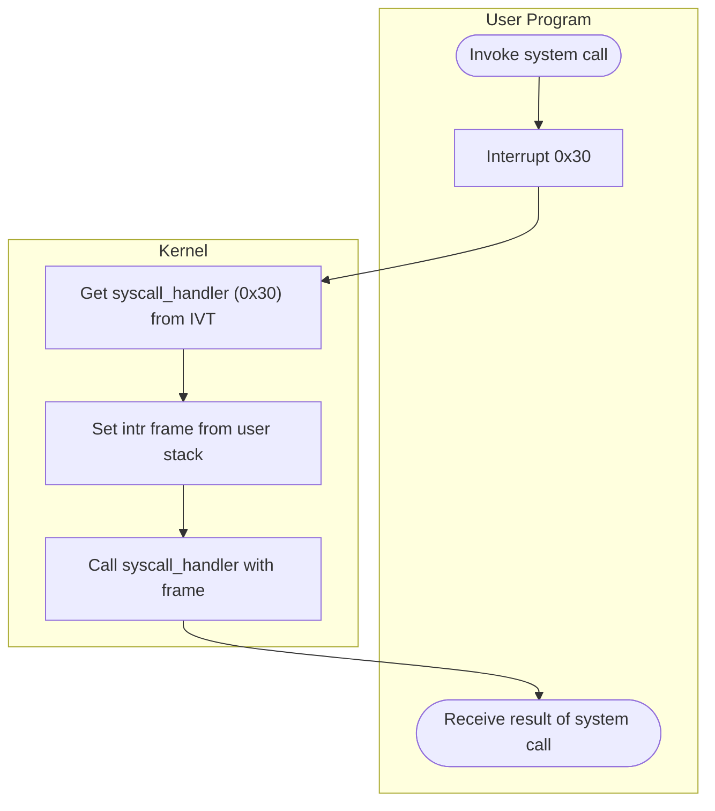

Lab 2: User Programs
===
김민석 (20180174), 권민재 (20190084) `CSED312`

# Introduction

## Background

운영체제가 비로소 의미를 가지기 위해서는 커널에서 정의된 프로그램들 뿐만 아니라 사용자들이 직접 작성한 프로그램을 실행시킬 수 있어야 한다. 그렇지 못하다면 프로그래밍 가능한 컴퓨터를 그저 임베디드 계산기로 사용하는 것에 불과하기 때문이다. 

이번 프로젝트에서는 user program들을 실행시키기 위한 인프라를 pintos에 구축하는 것이 목표이다. 이를 위해 커맨드라인 인자 전달, 프로세스 종료시 메시지 출력, 간단한 시스템콜, 실행파일 쓰기 금지 등을 구현할 것이다.


## Preparation for User Programs

### 1. Entrypoint
```c
// File: threads/init.c
/* Pintos main program. */
int
main (void)
{
  ...
  /* Segmentation. */
#ifdef USERPROG
  tss_init ();
  gdt_init ();
#endif
  ...
  /* Initialize interrupt handlers. */
  ...
#ifdef USERPROG
  exception_init ();
  syscall_init ();
#endif
  ...
  /* Run actions specified on kernel command line. */
  run_actions (argv);
  ...
}
```
Pintos는 우선 부팅되면 `thread.c`의 `main ()`이 호출된다. 이때, 기존 커널 프로그램들을 위해 준비하는 과정 외에 user program들을 이용하기 위해 준비하는 부분들을 살펴보아야 한다. 부팅 과정을 살펴보면, `tss_init ()`, `gdt_init ()`을 통해 User program에서 사용할 segmented architecture를 초기화한다. 또한, `exception_init ()`과 `syscall_init ()`을 이용하여 exception과 system call interrupt handler를 초기화한다. 이런 준비 과정 이후에 `run_actions ()`를 통해 본격적으로 행동을 취하는 것을 볼 수 있다.

### 2. TSS
#### 2.1. Structure
```c 
// File: userprog/tss.c
struct tss
  {
    uint16_t back_link, :16;
    void *esp0;                         /* Ring 0 stack virtual address. */
    uint16_t ss0, :16;                  /* Ring 0 stack segment selector. */
    void *esp1;
    uint16_t ss1, :16;
    void *esp2;
    uint16_t ss2, :16;
    uint32_t cr3;
    void (*eip) (void);
    uint32_t eflags;
    uint32_t eax, ecx, edx, ebx;
    uint32_t esp, ebp, esi, edi;
    uint16_t es, :16;
    uint16_t cs, :16;
    uint16_t ss, :16;
    uint16_t ds, :16;
    uint16_t fs, :16;
    uint16_t gs, :16;
    uint16_t ldt, :16;
    uint16_t trace, bitmap;
  };
```
TSS, Task-State Segment는 어떤 태스크의 실행 여부가 바뀌었을 때 이전 상태를 저장하기 위해 사용된다. 사실 대부분의 운영체제들은 이 TSS를 잘 이용하지 않지만, TSS를 꼭 이용해야 하는 경우가 있다. 바로 User mode에서 인터럽트가 발생했을 때이다. 인터럽트가 발생하면, 프로세서는 현재 TSS의 `ss0`와 `esp0` 필드를 통해 ring0의 스택 정보를 불러와서 인터럽트를 처리해야하기 때문이다. Pintos에서는 user mode에서의 인터럽트 상황이 아니면 TSS를 이용할 일이 없기 때문에, `ss0`와 `esp0`에 대한 핸들링만이 필수적이다.

#### 2.2. `tss_init ()`
```c
// File: userprog/tss.c
/* Initializes the kernel TSS. */
void
tss_init (void) 
{
  /* Our TSS is never used in a call gate or task gate, so only a
     few fields of it are ever referenced, and those are the only
     ones we initialize. */
  tss = palloc_get_page (PAL_ASSERT | PAL_ZERO);
  tss->ss0 = SEL_KDSEG;
  tss->bitmap = 0xdfff;
  tss_update ();
}
```
앞서 언급한대로, 주석을 살펴보면 pintos에서 TSS가 call gate나 task gate에서 이용되지 않는다는 것을 알 수 있다. 그렇기 때문에, `ss0`와 `bitmap`만을 설정하는 모습을 볼 수 있으며, `esp0`는 이후 `tss_update ()`에서 설정된다.

#### 2.3. `tss_update ()`

```c
void
tss_update (void) 
{
  ASSERT (tss != NULL);
  tss->esp0 = (uint8_t *) thread_current () + PGSIZE;
}
```
`tss_update ()`는 현재 스레드의 스택 주소를 TSS의 `esp0`에 할당한다. 이 함수는 `process_activate ()`와 `tss_init ()`에서 호출되어 커널 스택을 지정하는데 이용된다.

### 3. GDT
#### 3.1. Structure
```c 
static uint64_t gdt[SEL_CNT];
```
GDT, Global Descriptor Table은 기본적으로 descriptor의 집합이기 때문에 위와 같은 배열으로 선언되어 있다.

#### 3.2. `gdt_init ()`
```c 
void
gdt_init (void)
{
  uint64_t gdtr_operand;

  /* Initialize GDT. */
  gdt[SEL_NULL / sizeof *gdt] = 0;
  gdt[SEL_KCSEG / sizeof *gdt] = make_code_desc (0);
  gdt[SEL_KDSEG / sizeof *gdt] = make_data_desc (0);
  gdt[SEL_UCSEG / sizeof *gdt] = make_code_desc (3);
  gdt[SEL_UDSEG / sizeof *gdt] = make_data_desc (3);
  gdt[SEL_TSS / sizeof *gdt] = make_tss_desc (tss_get ());

  /* Load GDTR, TR.  See [IA32-v3a] 2.4.1 "Global Descriptor
     Table Register (GDTR)", 2.4.4 "Task Register (TR)", and
     6.2.4 "Task Register".  */
  gdtr_operand = make_gdtr_operand (sizeof gdt - 1, gdt);
  asm volatile ("lgdt %0" : : "m" (gdtr_operand));
  asm volatile ("ltr %w0" : : "q" (SEL_TSS));
}
```
`gdt_init ()`에서는 각 descriptor가 들어갈 공간들을 미리 준비해준다. 

### 3. `register_handler ()`
```c 
static void
register_handler (uint8_t vec_no, int dpl, enum intr_level level,
                  intr_handler_func *handler, const char *name)
{
  ASSERT (intr_handlers[vec_no] == NULL);
  if (level == INTR_ON)
    idt[vec_no] = make_trap_gate (intr_stubs[vec_no], dpl);
  else
    idt[vec_no] = make_intr_gate (intr_stubs[vec_no], dpl);
  intr_handlers[vec_no] = handler;
  intr_names[vec_no] = name;
}
```
```c 
/* Interrupt stack frame. */
struct intr_frame
  {
    /* Pushed by intr_entry in intr-stubs.S.
       These are the interrupted task's saved registers. */
    uint32_t edi;               /* Saved EDI. */
    uint32_t esi;               /* Saved ESI. */
    uint32_t ebp;               /* Saved EBP. */
    uint32_t esp_dummy;         /* Not used. */
    uint32_t ebx;               /* Saved EBX. */
    uint32_t edx;               /* Saved EDX. */
    uint32_t ecx;               /* Saved ECX. */
    uint32_t eax;               /* Saved EAX. */
    uint16_t gs, :16;           /* Saved GS segment register. */
    uint16_t fs, :16;           /* Saved FS segment register. */
    uint16_t es, :16;           /* Saved ES segment register. */
    uint16_t ds, :16;           /* Saved DS segment register. */

    /* Pushed by intrNN_stub in intr-stubs.S. */
    uint32_t vec_no;            /* Interrupt vector number. */

    /* Sometimes pushed by the CPU,
       otherwise for consistency pushed as 0 by intrNN_stub.
       The CPU puts it just under `eip', but we move it here. */
    uint32_t error_code;        /* Error code. */

    /* Pushed by intrNN_stub in intr-stubs.S.
       This frame pointer eases interpretation of backtraces. */
    void *frame_pointer;        /* Saved EBP (frame pointer). */

    /* Pushed by the CPU.
       These are the interrupted task's saved registers. */
    void (*eip) (void);         /* Next instruction to execute. */
    uint16_t cs, :16;           /* Code segment for eip. */
    uint32_t eflags;            /* Saved CPU flags. */
    void *esp;                  /* Saved stack pointer. */
    uint16_t ss, :16;           /* Data segment for esp. */
  };
```

`register_handler ()`는 IDT에 핸들러를 등록하기 위해서 이용된다. function pointer의 집합인 `intr_stubs`와 descriptor privilege level을 이용하여 interrupt gate를 생성하고 이를 IDT에 할당하는 과정을 포함한다. 또한, 각 vector 번호에 따른 핸들러와 이름을 부여하는 역할도 수행하고 있다. 이때, `intr_handler_func ()`의 인자로는 `intr_frame` 구조체가 이용된다. 이 인터럽트 프레임에는 현재 인터럽트된 태스크의 정보 등이 저장되어 있다.


### 4. `exception_init ()`
```c
// File: uerprog/exception.c
/* Registers handlers for interrupts that can be caused by user
   programs.
   ... */
void
exception_init (void) 
{
  /* These exceptions can be raised explicitly by a user program,
     e.g. via the INT, INT3, INTO, and BOUND instructions.  Thus,
     we set DPL==3, meaning that user programs are allowed to
     invoke them via these instructions. */
  intr_register_int (3, 3, INTR_ON, kill, "#BP Breakpoint Exception");
  // ...

  /* These exceptions have DPL==0, preventing user processes from
     invoking them via the INT instruction.  They can still be
     caused indirectly, e.g. #DE can be caused by dividing by
     0.  */
  intr_register_int (0, 0, INTR_ON, kill, "#DE Divide Error");
  // ...

  /* Most exceptions can be handled with interrupts turned on.
     We need to disable interrupts for page faults because the
     fault address is stored in CR2 and needs to be preserved. */
  intr_register_int (14, 0, INTR_OFF, page_fault, "#PF Page-Fault Exception");
 // ...
}
```

```c
// File: threads/interrupt.c
void
intr_register_int (uint8_t vec_no, int dpl, enum intr_level level,
                   intr_handler_func *handler, const char *name)
{
  ASSERT (vec_no < 0x20 || vec_no > 0x2f);
  register_handler (vec_no, dpl, level, handler, name);
}

```
`exception_init ()`에서는 `intr_register_int ()`를 통해 user mode 프로세스에서 걸릴 수 있는 인터럽트들과 그에 대응하는 handler를 설정하고 있다. `intr_register_int ()`는 단순히 벡터에 대한 assert를 수행하며, 같은 인자들로 `register_handler ()`를 호출하여 핸들러들을 등록하고 있다. 앞서 살펴본 것 처럼, `register_handler ()`가 IDT에 전달받은 벡터에 따른 핸들러를 등록해줄 것이고, 이를 통해 인터럽트가 등록되는 과정이 실현된다. 더불어, 기본적으로 모든 exception handler는 현재 프로세스를 종료 하는 과정을 포함하고 있다.

## System Call


### 1. Initialize
```c
// File: userprog/syscall.c
void
syscall_init (void) 
{
  intr_register_int (0x30, 3, INTR_ON, syscall_handler, "syscall");
}
```
`syscall_init ()`을 통해 user program이 system call을 이용할 수 있도록 만들어줄 수 있다. `syscall`은 커널 모드에서 작동되어야 하므로 커널 모드로의 전환을 위해 인터럽트를 이용할 수 있다. 즉, system call의 구현을 위해 이를 인터럽트의 일종으로 이용할 수 있다는 것이다. `intr_register_int ()`를 통해 0x30 인터럽트 핸들러로 `syscall_handler`를 IVT에 등록한다. 이때, `DPL == 3`이기 때문에 user mode에서 `syscall`을 invoke할 수 있도록 설정해주는 과정이 포함되었다.


### 2. Invoke
```c
// File: lib/user/syscall.c
/* Invokes syscall NUMBER, passing no arguments, and returns the
   return value as an `int'. */
#define syscall0(NUMBER)                                        \
        ({                                                      \
          int retval;                                           \
          asm volatile                                          \
            ("pushl %[number]; int $0x30; addl $4, %%esp"       \
               : "=a" (retval)                                  \
               : [number] "i" (NUMBER)                          \
               : "memory");                                     \
          retval;                                               \
        })

// ...

/* Invokes syscall NUMBER, passing arguments ARG0, ARG1, and
   ARG2, and returns the return value as an `int'. */
#define syscall3(NUMBER, ARG0, ARG1, ARG2)                      \
        ({                                                      \
          int retval;                                           \
          asm volatile                                          \
            ("pushl %[arg2]; pushl %[arg1]; pushl %[arg0]; "    \
             "pushl %[number]; int $0x30; addl $16, %%esp"      \
               : "=a" (retval)                                  \
               : [number] "i" (NUMBER),                         \
                 [arg0] "r" (ARG0),                             \
                 [arg1] "r" (ARG1),                             \
                 [arg2] "r" (ARG2)                              \
               : "memory");                                     \
          retval;                                               \
        })
```
User program이 system call을 할 경우에, 각 call의 구현에 따라서 위의 macro들 중 적합한 타입의 macro가 실행되어 system call이 요청된다. 이 macro들은 system call을 위한 어셈블리 코드를 실행한다. Argument의 개수에 따라 `syscall0`, `syscall1`, `syscall2`, `syscall3`이 존재한다. 일단 `syscall`이 불리면, argument들을 스택에 푸시하고, syscall 번호를 스택에 푸시한다. 이후 `int`를 통해 인터럽트를 호출한 후 esp를 통해 스택의 위치를 지정해준다. 이때, 인자의 개수에 따라 esp가 가리키는 값이 달라질 수 있도록 해야한다. 이때, `int $0x30;`은 Interrupt Vector Table에서 `syscall_handler ()`를 가리키고 있으므로, 인터럽트를 통해 핸들러를 실행하는 것이라고 해석할 수 있다. 핸들러가 종료되면 비로소 User program의 system call 과정이 종료된다.


## 3. Handler

```c
static void
syscall_handler (struct intr_frame *f UNUSED) 
{
  printf ("system call!\n");
  thread_exit ();
}
```

인터럽트를 통해 `syscall_handler ()`가 실행된다. 이제 이 핸들러를 통해 user program이 요청한 system call을 처리해야하며, 현재는 아무런 액션도 구현되어있지 않다. `intr_frame`에는 system call 요청 당시의 user stack이 들어있다. 즉, user stack에 포함되어 있는 system call 번호와 argument를 통해 요청받은 행동을 취할 수 있음을 뜻한다.


## Running User Program on Pintos
```flow
st=>start: main ()
op1=>operation: run_actions ()
op2=>operation: run_task ()
op4=>operation: start_process ()
op5=>operation: process_wait ()
para1=>parallel: process_execute ()
e=>end: terminate USER_PROGRAM 

st->op1->op2->para1(path1, right)->op4->e
para1(path2, bottom)->op5
e->op5
```


### 1. `run_actions ()`
```c
// File: threads/init.c
/* Executes all of the actions specified in ARGV[]
   up to the null pointer sentinel. */
static void
run_actions (char **argv) 
{
  /* An action. */
  struct action 
    {
      char *name;                       /* Action name. */
      int argc;                         /* # of args, including action name. */
      void (*function) (char **argv);   /* Function to execute action. */
    };

  /* Table of supported actions. */
  static const struct action actions[] = 
    {
      {"run", 2, run_task},
      ...
      {NULL, 0, NULL},
    };

  while (*argv != NULL)
    {
      const struct action *a;
      int i;

      /* Find action name. */
      for (a = actions; ; a++)
        if (a->name == NULL)
          PANIC ("unknown action `%s' (use -h for help)", *argv);
        else if (!strcmp (*argv, a->name))
          break;

      /* Check for required arguments. */
      for (i = 1; i < a->argc; i++)
        if (argv[i] == NULL)
          PANIC ("action `%s' requires %d argument(s)", *argv, a->argc - 1);

      /* Invoke action and advance. */
      a->function (argv);
      argv += a->argc;
    }
}
```
`run_actions ()`에서는 주어진 argument들을 파싱하고 태스트를 실행할 수 있도록 준비한다. 주어진 `argv` 배열에 대해서 반복을 진행하되, 반복자가 action의 argc만큼 증가하도록 하여 각 command별로 반복될 수 있도록 하였다. 해당 반복을 진행하면서 action이 valid한 action인지 확인하고, argument의 개수를 확인한다. 이러한 검증 과정 이후에 argv와 함께 function을 호출하여 실질적인 task를 실행할 수 있도록 만든다. 이때, action이 `run`일때, `run_task ()`가 호출되며, 이에 따라 user program들이 실행될 수 있다.


### 2. Task
#### 2.1. `run_task ()`
```c
// File: threads/init.c
/* Runs the task specified in ARGV[1]. */
static void
run_task (char **argv)
{
  const char *task = argv[1];
  
  printf ("Executing '%s':\n", task);
#ifdef USERPROG
  process_wait (process_execute (task));
#else
  // ...
#endif
  printf ("Execution of '%s' complete.\n", task);
}
```
User program의 관점에서, `run_task ()`는 주어진 task를 `process_execute ()`를 통해서 실행시키고, `process_wait ()`로 이를 대기한다. `process_wait ()`는 스레드가 terminate되고 종료 상태를 반환할 때 까지 대기해야하는 함수이지만, 현재로써는 아무것도 구현되어 있지 않기 때문에 차후에 구현해야할 부분이다.

#### 2.2. `process_execute ()`
```c
/* Starts a new thread running a user program loaded from
   FILENAME.  The new thread may be scheduled (and may even exit)
   before process_execute() returns.  Returns the new process's
   thread id, or TID_ERROR if the thread cannot be created. */
tid_t
process_execute (const char *file_name) 
{
  char *fn_copy;
  tid_t tid;

  /* Make a copy of FILE_NAME.
     Otherwise there's a race between the caller and load(). */
  fn_copy = palloc_get_page (0);
  if (fn_copy == NULL)
    return TID_ERROR;
  strlcpy (fn_copy, file_name, PGSIZE);

  /* Create a new thread to execute FILE_NAME. */
  tid = thread_create (file_name, PRI_DEFAULT, start_process, fn_copy);
  if (tid == TID_ERROR)
    palloc_free_page (fn_copy); 
  return tid;
}
```
`process_execute ()`는 주어진 파일 이름으로부터 user program을 불러와서 새로운 스레드를 실행시킨다. 이때, 레이스 컨디션을 방지하기 위해서 파일을 로드할 때 파일명의 복사본을 이용해야 한다. 이후, `thread_create ()`를 이용하여 스레드 생성을 요청하고, 이때 `start_process ()`와 함께, 이의 인자로 파일명 복사본이 전달된다. `palloc_get_page ()`로 페이지를 할당받는데 실패하거나, `thread_create ()`가 스레드를 생성하는데 실패하면 TID_ERROR나 thread id를 반환해야한다.

#### 2.3. `start_process ()`

```c
/* A thread function that loads a user process and starts it
   running. */
static void
start_process (void *file_name_)
{
  char *file_name = file_name_;
  struct intr_frame if_;
  bool success;

  /* Initialize interrupt frame and load executable. */
  memset (&if_, 0, sizeof if_);
  if_.gs = if_.fs = if_.es = if_.ds = if_.ss = SEL_UDSEG;
  if_.cs = SEL_UCSEG;
  if_.eflags = FLAG_IF | FLAG_MBS;
  success = load (file_name, &if_.eip, &if_.esp);

  /* If load failed, quit. */
  palloc_free_page (file_name);
  if (!success) 
    thread_exit ();

  /* Start the user process by simulating a return from an
     interrupt, implemented by intr_exit (in
     threads/intr-stubs.S).  Because intr_exit takes all of its
     arguments on the stack in the form of a `struct intr_frame',
     we just point the stack pointer (%esp) to our stack frame
     and jump to it. */
  asm volatile ("movl %0, %%esp; jmp intr_exit" : : "g" (&if_) : "memory");
  NOT_REACHED ();
}
```
```assembly
.globl intr_exit
.func intr_exit
intr_exit:
        /* Restore caller's registers. */
	popal
	popl %gs
	popl %fs
	popl %es
	popl %ds

        /* Discard `struct intr_frame' vec_no, error_code,
           frame_pointer members. */
	addl $12, %esp

        /* Return to caller. */
	iret
.endfunc
```
`start_process`는 인터럽트 프레임을 초기화하고, 해당 프레임의 레지스터 정보를 이용해서 `load ()` 함수를 호출한다. 만약 `load ()`에 실패했다면 스레드를 바로 종료시킨다. `load ()`에 성공했다면, user program을 어떤 인터럽트의 종료 이후에 실행되는 것이라고 생각하고 실행시킨다. `intr_exit`는 앞선 인터럽트 프레임을 초기화시키므로, 이의 실행 이후에 esp를 실행할 스레드의 스택 프레임으로 지정하고 jump하는 것은 합당하다.


##### 2.3.1. `load ()`
```c
  /* Allocate and activate page directory. */
  t->pagedir = pagedir_create ();
  if (t->pagedir == NULL) 
    goto done;
  process_activate ();
```
> ```c
> uint32_t *
> pagedir_create (void) 
> {
>   uint32_t *pd = palloc_get_page (0);
>   if (pd != NULL)
>     memcpy (pd, init_page_dir, PGSIZE);
>   return pd;
> }
> ```


> ```c
> void process_activate (void)
> {
>   struct thread *t = thread_current ();
> 
>   /* Activate thread's page tables. */
>   pagedir_activate (t->pagedir);
> 
>   /* Set thread's kernel stack for use in processing
>      interrupts. */
>   tss_update ();
> }
> ```

> ```c
> void
> pagedir_activate (uint32_t *pd) 
> {
>   if (pd == NULL)
>     pd = init_page_dir;
> 
>   /* Store the physical address of the page directory into CR3
>      aka PDBR (page directory base register).  This activates our
>      new page tables immediately.  See [IA32-v2a] "MOV--Move
>      to/from Control Registers" and [IA32-v3a] 3.7.5 "Base
>      Address of the Page Directory". */
>   asm volatile ("movl %0, %%cr3" : : "r" (vtop (pd)) : "memory");
> }

우선 실행 파일을 로드하기 위해서 `pagedir_create ()`로 pagedir를 획득하고, `process_activate ()`를 호출한다. `process_activate ()`는 `pagedir_activate ()`를 호출하여 이 프로세스의 page directory의 실제 주소를 PDBR에 저장시키도록 한다. 이 과정을 통해 이 프로세스의 page directory가 활성화될 수 있다. 이후, `tss_update ()`를 통해 TSS의 `esp0`를 업데이트할 수 있도록 한다. 만약 페이지 디렉토리 할당에 실패했다면, `load ()`를 바로 종료시킨다.

```c
  /* Open executable file. */
  file = filesys_open (file_name);
  if (file == NULL) 
    {
      printf ("load: %s: open failed\n", file_name);
      goto done; 
    }
  /* Read and verify executable header. */
  if (file_read (file, &ehdr, sizeof ehdr) != sizeof ehdr
      || memcmp (ehdr.e_ident, "\177ELF\1\1\1", 7)
      || ehdr.e_type != 2
      || ehdr.e_machine != 3
      || ehdr.e_version != 1
      || ehdr.e_phentsize != sizeof (struct Elf32_Phdr)
      || ehdr.e_phnum > 1024) 
    {
      printf ("load: %s: error loading executable\n", file_name);
      goto done; 
    }
```
> ```c
> struct file *
> filesys_open (const char *name)
> {
>   struct dir *dir = dir_open_root ();
>   struct inode *inode = NULL;
> 
>   if (dir != NULL)
>     dir_lookup (dir, name, &inode);
>   dir_close (dir);
> 
>   return file_open (inode);
> }
> ```

페이지를 활성화시킨 이후에, 주어진 파일을 읽고 검증하는 과정에 돌입한다. `filesys_open ()` 함수를 이용하여 루트 폴더로부터 주어진 파일을 읽을 수 있다. 만약 파일을 읽는데 실패했다면, `load ()`를 바로 종료시킨다. 이후, `ehdr`에 파일의 헤더를 불러와서 해당 파일이 ELF 포맷인지 확인하는 과정을 거친다. 만약 ELF 포맷의 파일이 아니라면 `load ()` 함수를 바로 종료시킨다. 

```c
  /* Read program headers. */
  file_ofs = ehdr.e_phoff;
  for (i = 0; i < ehdr.e_phnum; i++) 
    {
      struct Elf32_Phdr phdr;

      if (file_ofs < 0 || file_ofs > file_length (file))
        goto done;
      file_seek (file, file_ofs);

      if (file_read (file, &phdr, sizeof phdr) != sizeof phdr)
        goto done;
      file_ofs += sizeof phdr;
      switch (phdr.p_type) 
        {
        case PT_NULL:
        case PT_NOTE:
        case PT_PHDR:
        case PT_STACK:
        default:
          /* Ignore this segment. */
          break;
        case PT_DYNAMIC:
        case PT_INTERP:
        case PT_SHLIB:
          goto done;
        case PT_LOAD:
          if (validate_segment (&phdr, file)) 
            {
              bool writable = (phdr.p_flags & PF_W) != 0;
              uint32_t file_page = phdr.p_offset & ~PGMASK;
              uint32_t mem_page = phdr.p_vaddr & ~PGMASK;
              uint32_t page_offset = phdr.p_vaddr & PGMASK;
              uint32_t read_bytes, zero_bytes;
              if (phdr.p_filesz > 0)
                {
                  /* Normal segment.
                     Read initial part from disk and zero the rest. */
                  read_bytes = page_offset + phdr.p_filesz;
                  zero_bytes = (ROUND_UP (page_offset + phdr.p_memsz, PGSIZE)
                                - read_bytes);
                }
              else 
                {
                  /* Entirely zero.
                     Don't read anything from disk. */
                  read_bytes = 0;
                  zero_bytes = ROUND_UP (page_offset + phdr.p_memsz, PGSIZE);
                }
              if (!load_segment (file, file_page, (void *) mem_page,
                                 read_bytes, zero_bytes, writable))
                goto done;
            }
          else
            goto done;
          break;
        }
    }
```
이후, ELF의 PHDR 엔트리를 순회하면서 PHDR을 불러온다. 프로그램의 타입이 `PT_LOAD`이면, 첫번째 세그먼트의 오프셋 (p_offset)과 세그먼트의 첫번째 가상 주소 (p_vaddr)으로부터 페이지와 오프셋 주소를 구해내고, 이를 이용하여 `load_segment ()`를 호출한다. `load_segment ()`는 파일을 끝까지 읽을 때까지 페이지를 할당받아서 해당 페이지에 파일을 페이지 크기만큼 삽입하는 과정을 반복한다. 만약 `load_segment ()`에 실패했다면 `load ()`를 종료시킨다.
```c
  /* Set up stack. */
  if (!setup_stack (esp))
    goto done;
  /* Start address. */
  *eip = (void (*) (void)) ehdr.e_entry;

  success = true;

 done:
  /* We arrive here whether the load is successful or not. */
  file_close (file);
  return success;
```
> ```c
> static bool
> setup_stack (void **esp) 
> {
>   uint8_t *kpage;
>   bool success = false;
> 
>   kpage = palloc_get_page (PAL_USER | PAL_ZERO);
>   if (kpage != NULL) 
>     {
>       success = install_page (((uint8_t *) PHYS_BASE) - PGSIZE, kpage, true);
>       if (success)
>         *esp = PHYS_BASE;
>       else
>         palloc_free_page (kpage);
>     }
>   return success;
> }
> ```

파일로부터 세그먼트 로딩에 성공했다면, 이제 스택을 구성할 차례이다. `setup_stack ()`을 통해서 스택을 구성하며, `setup_stack ()`은 페이지를 할당받고 `install_page ()`를 통해 user virtual address를 kernel virtual address에 연결시킨 후 esp 주소를 설정해준다. 만약 이 과정에 실패했다면, `load ()` 함수를 바로 종료시킨다. 마지막으로 eip를 ELF의 엔트리포인트로 설정하여 ELF의 로딩을 마무리한다. 이전에 한번도 `done`으로 점프하지 않았다면, success를 true로 설정하여 로딩에 성공했음을 표시한다. 이후, 열린 file을 닫고 success를 리턴하여 로딩 성공 여부를 알린다.


## Using the File System
유저 프로그램은 file system에서 로드되며, 추후 구현할 system call 중 file system을 이용해야하는 것들이 존재한다. 

### 1. Structure
```c 
struct inode 
  {
    struct list_elem elem;              /* Element in inode list. */
    block_sector_t sector;              /* Sector number of disk location. */
    int open_cnt;                       /* Number of openers. */
    bool removed;                       /* True if deleted, false otherwise. */
    int deny_write_cnt;                 /* 0: writes ok, >0: deny writes. */
    struct inode_disk data;             /* Inode content. */
  };
```

> ```c
> /* On-disk inode.
>    Must be exactly BLOCK_SECTOR_SIZE bytes long. */
> struct inode_disk
>   {
>     block_sector_t start;               /* First data sector. */
>     off_t length;                       /* File size in bytes. */
>     unsigned magic;                     /* Magic number. */
>     uint32_t unused[125];               /* Not used. */
>   };
> ```
> 
`inode`는 일반적으로 UNIX 파일 시스템에서 파일을 관리하기 위해 주로 이용하는 자료구조이다. Pintos에서는 디스크에서의 위치, opener들의 개수, 삭제 여부, 쓰기 허용 여부, 마지막으로 콘텐츠를 포함하고 있다. 콘텐츠는  `inode_disk`를 통해 관리되는데, `inode_disk`는 파일이 실제 디스크에서 존재하는 위치와 길이로 구성되며, `inode_disk`임을 식별하기 위한 magic number를 포함한다. Pintos에서는 실제 UNIX 파일 시스템에서 이용하는 것보다 훨씬 간소화된 형태의 inode를 이용하는 것을 알 수 있다.

```c
// File: filesys/file.c
/* An open file. */
struct file 
  {
    struct inode *inode;        /* File's inode. */
    off_t pos;                  /* Current position. */
    bool deny_write;            /* Has file_deny_write() been called? */
  };
```
앞서 살펴본 `inode`는 `file` 구조체로 wrapping된다. file 구조체는 inode 포인터를 포함하며, 현재 읽고 있는 곳의 위치를 저장한다. 이때, `deny_write` 필드를 통해 쓰기가 금지된 파일인지 그 여부를 기록하고 있다.

### 2. Open

```c 
struct file *
file_open (struct inode *inode) 
{
  struct file *file = calloc (1, sizeof *file);
  if (inode != NULL && file != NULL)
    {
      file->inode = inode;
      file->pos = 0;
      file->deny_write = false;
      return file;
    }
  else
    {
      inode_close (inode);
      free (file);
      return NULL; 
    }
}
```
파일을 열 때에는 주어진 inode로부터 file을 구성한다. 우선 file을 동적으로 할당한 이후, 할당에 성공하고 inode가 NULL이 아닌 경우에 file을 초기화하고 반환한다. 이 과정에 실패했을 경우, inode를 닫고, 기존에 할당한 file은 할당 해제하게 된다. `inode_close ()`를 호출하면, inode의 opener 개수를 줄인다. 이때, 만약 opener가 하나도 없게 된다면, inode를 리스트에서 삭제하고 연관된 공간들을 할당 해제하는 과정을 거치게 된다.

### 3. Reopen
```c
struct file *
file_reopen (struct file *file) 
{
  return file_open (inode_reopen (file->inode));
}
```
inode가 주어지지 않고, file이 주어지며, 주어진 file로부터 새로운 file 구조체를 만든다. `inode_reopen ()`은 단순히 opener의 개수를 1 증가시켜주는 역할을 수행한다.

### 4. Close

```c
void
file_close (struct file *file) 
{
  if (file != NULL)
    {
      file_allow_write (file);
      inode_close (file->inode);
      free (file); 
    }
}
```
주어진 파일을 닫을 때에는 file에 대한 쓰기를 허용시키고, `inode_close`로 inode를 닫는 과정이 수반된다. 이후, file에 대한 동적 할당을 해제하여 파일을 완전히 닫게 된다.

### 5. Get inode
```c
struct inode *
file_get_inode (struct file *file) 
{
  return file->inode;
}
```
이 함수는 단순히 현재 file에 상응하는 inode를 반환하는 역할을 수행한다.

### 6. Read
#### 6.1. Read from position
```c
off_t
file_read (struct file *file, void *buffer, off_t size) 
{
  off_t bytes_read = inode_read_at (file->inode, buffer, size, file->pos);
  file->pos += bytes_read;
  return bytes_read;
}
```
`file_read ()`는 주어진 버퍼에 file의 position으로부터 size 만큼 읽어서 넣는 역할을 수행한다. `inode_read_at ()`은 디스크에서 섹션과 블록을 순회하면서 파일을 읽고 버퍼에 해당 데이터를 삽입하는 역할을 한다. 이때, 읽은 바이트 수를 반환하며, 이 값은 file의 position에 더해지게 된다. 또한, `file_read ()`가 최종적으로 이 바이트 수를 반환한다.

#### 6.2. Read from given offset
```c
off_t
file_read_at (struct file *file, void *buffer, off_t size, off_t file_ofs) 
{
  return inode_read_at (file->inode, buffer, size, file_ofs);
}
```
`file_read_at ()`은 `file_read ()`와 달리 주어진 오프셋으로부터 주어진 크기만큼 읽어서 버퍼에 그 데이터를 담는다. file의 position을 증가시킬 필요가 없기 때문에, 주어진 오프셋으로부터 `inode_read_at ()`을 호출하고 반환되는 읽은 바이트 수를 그대로 반환하기만 하면 된다.

### 7. Write
#### 7.1. Write to position
```c
off_t
file_write (struct file *file, const void *buffer, off_t size) 
{
  off_t bytes_written = inode_write_at (file->inode, buffer, size, file->pos);
  file->pos += bytes_written;
  return bytes_written;
}
```
`file_write ()`는 현재 file의 position에 주어진 size 만큼 buffer에 있는 데이터를 쓰는 역할을 수행한다. `inode_write_at ()`이 호출되면, 디스크의 섹터와 블록을 순회하면서 블록에 주어진 데이터를 쓰게 된다. 이후, `inode_write_at ()`는 쓴 데이터의 바이트 수를 반환하게 되는데, 이는 file의 position에 더해지며, 마지막으로 `file_write ()`가 반환하는 값이 된다.

### 7.2. Write to given offset
```c
off_t
file_write_at (struct file *file, const void *buffer, off_t size,
               off_t file_ofs) 
{
  return inode_write_at (file->inode, buffer, size, file_ofs);
}
```
`file_write_at ()`은 주어진 offset에 size 만큼 buffer에 있는 데이터를 쓰는 역할을 수행한다. 

### 8. Deny write
```c
void
file_deny_write (struct file *file) 
{
  ASSERT (file != NULL);
  if (!file->deny_write) 
    {
      file->deny_write = true;
      inode_deny_write (file->inode);
    }
}
```
`file_deny_write ()`는 file에 대한 쓰기를 금지시킨다. 이를 위해 file의 deny_write를 true로 설정할 뿐만 아니라, `inode_deny_write ()`를 호출하여 inode의 `deny_write_cnt`를 증가시킨다.

### 9. Allow write
```c
void
file_allow_write (struct file *file) 
{
  ASSERT (file != NULL);
  if (file->deny_write) 
    {
      file->deny_write = false;
      inode_allow_write (file->inode);
    }
}
```
`file_allow_write ()`는 file에 대한 쓰기를 허용시킨다. 이를 위해 file의 deny_write를 false로 설정할 뿐만 아니라, `inode_allow_write ()`를 호출하여 inode의 `deny_write_cnt`를 감소시킨다.

### 10. Length
```c
/* Returns the size of FILE in bytes. */
off_t
file_length (struct file *file) 
{
  ASSERT (file != NULL);
  return inode_length (file->inode);
}
```
`file_length ()`는 `inode_length ()`를 호출하여 파일의 길이를 반환한다. `inode_length ()`는 단순히 `inode`의 data 길이를 반환하는 역할을 수행한다.

### 11. Seek
```c
void
file_seek (struct file *file, off_t new_pos)
{
  ASSERT (file != NULL);
  ASSERT (new_pos >= 0);
  file->pos = new_pos;
}
```
`file_seek ()`는 주어진 position으로 file의 position을 재설정한다.

### 12. Tell
```c
off_t
file_tell (struct file *file) 
{
  ASSERT (file != NULL);
  return file->pos;
}
```
`file_tell ()`은 단순히 현재 파일의 position을 반환하는 역할을 수행한다.

### 13. Initialize file system
```c
void
filesys_init (bool format) 
{
  fs_device = block_get_role (BLOCK_FILESYS);
  if (fs_device == NULL)
    PANIC ("No file system device found, can't initialize file system.");

  inode_init ();
  free_map_init ();

  if (format) 
    do_format ();

  free_map_open ();
}
```
`filesys_init ()`은 pintos가 사용할 파일 시스템을 초기화하는 역할을 수행한다. 우선 파일 시스템 디바이스를 획득한 이후에, `inode_init ()`을 통해 inode 리스트를 초기화한다. 또한, `free_map_init ()`을 통해 bitmap을 초기화 시킬 수 있도록 한다. 만약 파일 시스템 초기화와 함께 format을 진행한다면, `do_format ()`을 호출하도록 한다. 이 함수는 차후에 별도로 살펴볼 것이다. 앞서 살펴본 과정이 모두 성공적으로 진행되었다면, `free_map_open ()`을 호출하여 free map file을 불러올 수 있도록 한다.

### 14. Shutdown file system
```c
void
filesys_done (void) 
{
  free_map_close ();
}
```
파일 시스템을 종료하기 위해서 `free_map_close ()`를 호출한다. `free_map_close ()`는 `free_map_file`을 close하는 역할을 수행한다.

### 15. Create file
```c
bool
filesys_create (const char *name, off_t initial_size) 
{
  block_sector_t inode_sector = 0;
  struct dir *dir = dir_open_root ();
  bool success = (dir != NULL
                  && free_map_allocate (1, &inode_sector)
                  && inode_create (inode_sector, initial_size)
                  && dir_add (dir, name, inode_sector));
  if (!success && inode_sector != 0) 
    free_map_release (inode_sector, 1);
  dir_close (dir);

  return success;
}
```
`filesys_create ()` 주어진 파일 이름과 사이즈로 파일을 생성하는 역할을 수행한다. 함수가 호출되면 우선 `dir_open_root ()`로 루트 디렉터리 섹터의 inode로부터 디렉토리를 연다. 이후에 free map을 할당하고, inode를 생성한 후 디렉토리에 추가한다. 만약 이 과정에 실패했다면, free map을 할당 해제한다. 마지막으로 `dir_close ()`를 이용하여 디렉토리를 닫은 이후에 생성 성공 여부를 반환한다.

### 16. Open within file system
```c
struct file *
filesys_open (const char *name)
{
  struct dir *dir = dir_open_root ();
  struct inode *inode = NULL;

  if (dir != NULL)
    dir_lookup (dir, name, &inode);
  dir_close (dir);

  return file_open (inode);
}
```
`filesys_open ()`은 주어진 파일 이름으로부터 파일을 열어서 file pointer를 반환한다. 함수가 호출되면 우선 `dir_open_root`로 루트 섹터를 열게 된다. 이후, `dir_lookup ()`을 통해 디렉토리에서 주어진 파일 이름과 같은 엔트리가 있는지 탐색하여, 해당 엔트리의 inode로부터 파일을 열어서 반환하게 된다. 이 함수는 실행 파일을 로드할때 이용된다.

### 17. Remove
```c
bool
filesys_remove (const char *name) 
{
  struct dir *dir = dir_open_root ();
  bool success = dir != NULL && dir_remove (dir, name);
  dir_close (dir); 

  return success;
}
```
`filesys_remove ()`는 주어진 파일 이름에 해당하는 파일을 삭제한다. 루트 섹터 디렉토리에서 `dir_remove ()`를 이용하여 디렉토리에서 주어진 파일 이름에 합치하는 inode를 찾고, 해당 inode와 그 엔트리를 삭제하는 과정을 거친다. 마지막으로 이 함수는 성공 여부를 반환하면 종료된다.

### 18. Format
```c
/* Formats the file system. */
static void
do_format (void)
{
  printf ("Formatting file system...");
  free_map_create ();
  if (!dir_create (ROOT_DIR_SECTOR, 16))
    PANIC ("root directory creation failed");
  free_map_close ();
  printf ("done.\n");
}
```
이 파일 시스템의 포맷은 단순히 새로운 free map을 생성하는 것으로 갈음된다. `free_map_create ()`를 통해 새로운 free map inode를 생성하고 `free_map_file`를 초기화한다. 이후, `dir_create ()`를 통해 `ROOT_DIR_SECTOR`에 디렉토리를 생성한다. 만약 이 과정들에 실패하면 커널 패닉이 일어나며, 이 함수의 별도 반환값은 존재하지 않는다.


## Virtual Memory
```c
// File: threads/vaddr.h
/* Base address of the 1:1 physical-to-virtual mapping.  Physical
   memory is mapped starting at this virtual address.  Thus,
   physical address 0 is accessible at PHYS_BASE, physical
   address address 0x1234 at (uint8_t *) PHYS_BASE + 0x1234, and
   so on.

   This address also marks the end of user programs' address
   space.  Up to this point in memory, user programs are allowed
   to map whatever they like.  At this point and above, the
   virtual address space belongs to the kernel. */
#define	PHYS_BASE ((void *) LOADER_PHYS_BASE)
```
```c
// File: threads/loader.h
/* Kernel virtual address at which all physical memory is mapped.
   Must be aligned on a 4 MB boundary. */
#define LOADER_PHYS_BASE 0xc0000000     /* 3 GB. */
```
Pintos의 가상 메모리는 kernel 가상 메모리와 유저 가상 메모리로 나뉜다. 유저 가상 메모리는 `0`부터 `0xc000000`까지 3GB 이다. kernel 가상 메모리는 나머지 가상 메모리 공간을 차지 한다. User program은 본인의 유저 가상 메모리에만 접근할 수 있다. Kernel은 user program이 전달한 포인터를 통해 메모리를 참조 한다. 이 포인터가 unmapped 가상공간, 널, 커널 가상 메모리를 참조할 때 kernel은 본인과 다른 프로그램에 영향을 미치지 않도록 해당 유저 프로그램을 종료 시키고 자원을 수거해야 한다.

# Process Termination Messages
유저 프로세스가 종료 될 때 프로세스의 이름과 exit code를 아래 포맷으로 출력해야한다.
```c
printf ("%s: exit(%d)\n", ...);
```
프로세스 이름으로는 `process_execute ()`에 전달된 이름을 출력 한다. 단, kernel 스레드가 종료 될 때와 halt system call이 invoke 됐을 때는 메시지를 출력하지 않는다. 이번에 구현할 `sys_exit ()` 함수에서 메시지를 출력하면 위 조건을 만족할 수 있다.

## Implementation
```c
// File: userprog/syscall.c
void
sys_exit (int status)
{
  // thread_current ()-> exit stauts = status
  // Print termination message
  // thread_exit ()
}
```

# Argument Passing
현재 `process_execute ()`는 새로운 프로세스로 argument를 전달 할 수 없다. `process_execute ()`에서 전달 받은 문자열을 parsing해 파일 명과 argument를 나눈다. `strtok_r ()` 함수를 사용해 문자열을 parsing 할 수 있다.

```c
// File: lib/string.c
/* Breaks a string into tokens separated by DELIMITERS. 
   ...
   Example usage:

   char s[] = "  String to  tokenize. ";
   char *token, *save_ptr;

   for (token = strtok_r (s, " ", &save_ptr); token != NULL;
        token = strtok_r (NULL, " ", &save_ptr))
     printf ("'%s'\n", token);

   outputs:

     'String'
     'to'
     'tokenize.'
*/
char *
strtok_r (char *s, const char *delimiters, char **save_ptr) 
```

> ```
> Address       Name            Data          Type
> 0xbffffffc    argv[3][...]    bar\0         char[4]
> 0xbffffff8    argv[2][...]    foo\0         char[4]
> 0xbffffff5    argv[1][...]    -l\0          char[3]
> 0xbfffffed    argv[0][...]    /bin/ls\0     char[8]
> 0xbfffffec    word-align      0             uint8_t
> 0xbfffffe8    argv[4]         0             char *
> 0xbfffffe4    argv[3]         0xbffffffc    char *
> 0xbfffffe0    argv[2]         0xbffffff8    char *
> 0xbfffffdc    argv[1]         0xbffffff5    char *
> 0xbfffffd8    argv[0]         0xbfffffed    char *
> 0xbfffffd4    argv            0xbfffffd8    char **
> 0xbfffffd0    argc            4             int
> 0xbfffffcc    return address  0             void (*) ()
> ```

위 예시는 `PHYS_BASE`가 `0xc0000000`으로 pintos와 동일한 시스템의 스택 예시이다. 위와 같은 형식으로 앞서 parsing한 인자를 스택에 저장하는 함수 `init_stack_arg ()`를 선언 한다. `start_process ()` 함수에서 `init_stack_arg ()`를 호출해 프로세스 스택에 인자를 저장 한다.

## Implementation
```c
// File: userprog/process.c
/* A thread function that loads a user process and starts it
   running. */
static void
start_process (void *file_name_)
{
  ...
  /* Initialize interrupt frame and load executable. */
  ...
  
  // Pars arguments.
  // success = load (PARED_FILE_NAME, &if_.eip, &if_.esp);
  // if (success) init_stack_arg ()
  
  /* If load failed, quit. */
  ...
}
```

```c
// File: userprog/process.c
/* Initialize stack with passed arguments. */
void
init_stack_arg (char **argv, int argc, void **esp)
{
  // Move down ESP as doing below instructions
  // (ESP is pointing bottom of the stack.)
  //   Push ARGVs into the stack
  //   Align stack pointer by mutiple of 4
  //     for better performance 
  //   Push addresses of ARGVs
  //   Push ARGV
  //   Push ARGC
  //   Push return addr (0)
}
```

# System Calls
현재 모든 system call handler는 process를 종료 시킨다. System call number를 바탕으로 system call argument를 활용해 적절할 동작을 취하는 handler를 구현한다.
System call number는 user의 virtual address space의 user stack에 존재하기 때문에 user virtual adress space에 read/write할 방법을 고안해야 한다. 이때 유저가 invalid한 pointer를 전달했을 수 있으므로 해당 경우엔 user process를 종료 시킨다.

구현해야할 system call은 다음과 같다.

> ```c
> void halt (void)
>   // `shutdown_power_off()`를 호출해 pintos 종료
> 
> void exit (int status)
>   // 현재 스레드를 종료하고 STAUS를 kernel 스레드로 전달
>   // `0`은 성공, 그 외 값은 에러를 의미 한다.
> 
> pid_t exec (const char *cmd_line)
>   // Synchronization을 사용해 CMD_LINE을 통해 전달된 instruction을 실행하고
>   // 새로운 process의 pid가 return 될때까지 부모 process를 wait 시킨다.
>   // 프로그램을 `load`하거나 `run`할 수 없는 경우 `-1`을 반환 한다.
> 
> int wait (pid_t pid)
>   // Child process(PID)가 종료 될때까지 기다리고 
>   //   child process의 exit status를 반환 받는다.
>   // 만약 child process가 비정상 종료 됐을 경우 `-1`을 반환 받는다.
> 
> bool create (const char *file, unsigned initial_size)
>   // INITIAL_SIZE의 file FILE을 생성한다.
>   // 성공 여부를 반환 한다.
> 
> bool remove (const char *file)
>   // FILE file을 삭제한다.
>   // 성공 여부를 반환 한다.
>   // File이 열려있어도 삭제한다. 열려있는 파일을 삭제함으로써 파일이 닫히진 않는다.
>
>  int open (const char *file)
>   // FILE file을 연다. 
>   // 성공시 `file descriptor`(fd)를 반환, 실패시 `-1`을 반환 한다.
>   // 각 프로세스는 독립적인 fd set을 갖는다.
> 
> int filesize (int fd)
>   // FD가 담당하는 file의 size를 byte 단위로 반환 한다.
> 
> int read (int fd, void *buffer, unsigned size)
>   // FD로 부터 SIZE byte만큰을 BUFFER로 읽어들인다.
>   // 실제로 읽어진 byte를 반환 한다. 아무것도 읽지 못한 경우 `-1`을 반환 한다. 
> 
> int write (int fd, const void *buffer, unsigned size)
>   // FD에 SIZE byte만큼의 BUFFER를 write한다.
>   // 실제 write한 byte를 반환 한다.
>
>  void seek (int fd, unsigned position)
>   // FD의 position을 POSITION으로 변경 한다.
>
>  unsigned tell (int fd)
>   // FD의 position을 반환 한다.
> 
> void close (int fd)
>   // FD를 close 한다. Process를 종료할때 procecc의 fd는 모두 close 돼야 한다.
> ```

## Implementation
### `syscall_handler ()`
```c
// File: userprog/syscall.c
static void
syscall_handler (struct intr_frame *f) 
{
  // If passed address is invalid, exit program.
  // if (!validate_addr (f->esp)) sys_exit(-1)
  // By system call number from the stack invoke correspoding handler 
  //   w/ arguments from get_argument ()
  
  // System call handlers
}
```

### `validate_addr ()`
앞서 분석한 pintos 스택의 특성을 활용해 user process로 부터 전달 받은 포인터가 유효한지 확인 하는 함수 `validate_addr ()`를 선언한다.

```c
bool
validate_addr (void * addr)
{
  // ADDR이 커널 스택, 유저 스택 밖의 공간, 널을 가르킬 경우 FALSE
  // 유효한 포인터 일경우 TRUE
}
```

### `get_argument ()`
```c
// File: userprog/syscall.c
void
get_argument (void *esp, int *argv, int *argc)
{
  // As long as ESP is valid get ARG ARGC times.
}
```
스택에서 system call의 인자를 추출 한다.

### `struct pcb`
Process의 정보와 status를 담은 PCB(Process Control Block)을 구조체로 만들어 각 process의 정보를 관리하도록 한다. 
(Pintos의 process는 하나의 thread로 이뤄짐)
```c
// File: userprog/process.h
struct pcb {
  pid_t pid;
  // 부모 process
  // 파일 시스템 접근을 위한 synch. 및 flag
  // wait syscall 위한 synch.
  // Process가 관리하는 fd
  // Process가 실행 중인 파일
}
```
```c
// File: threads/thread.h
struct thread
  {
    ...
#ifdef USERPROG
  struct pcb * pcb;
  }
```
```c
// File: userprog/process.c
/* A thread function that loads a user process and starts it
   running. */
static void
start_process (void *file_name_)
{
  ... 
  // Initialize thread_current ()->pcb  datas
  ...
}
```

### `child_list`
Child process를 관리하기 위해 스레드에 list field를 추가한다.
```c
// File: threads/thread.h
struct thread
  {
    ...
#ifdef USERPROG
  ...
  struct list child_list;
  ...
  }
```
child_tid의 `pcb`를 반환하는 함수 `get_child_process ()`를 선언한다.
```c
// File: threads/thread.c
struct pcb
get_child_process (tid_t child_tid)
{
  //if (current_thread ()->child_list->contains (child_tid)) 
  //  return child_list (child_tid)
  //else return NULL
  
  // Invoked when child's information is needed e.g. process_wait ()
}
```

# Denying Writes to Executables

## Problem Description

현재 실행 중인 바이너리 파일이 수정될 경우, 프로그램의 정상적인 작동을 기대할 수 없다. 그렇기 때문에, 현재 실행 중인 파일을 수정하지 못하게 하는 로직의 추가가 필수적이다.

## Analysis

현재 실행 중인 파일들에 대한 쓰기를 금지시키기 위해서는 현재 실행 중인 파일이 무엇이 있는지 트래킹하는 과정이 필수불가결할 것이다. 이를 위해 현재 실행 중인 파일 리스트를 만들어서 관리하는 방법을 생각해볼 수 있다. 하지만, 어떤 프로세스가 종료될 때 마다 그 프로세스가 실행하고 있었던 파일을 파일 리스트에서 찾아서 제거하는 과정은 매우 번거로울 수 있다. 그렇기 때문에, 파일 리스트를 만들어서 관리하는 대신, 프로세스가 시작되고 파일이 load 될 때 실행할 파일에 대한 쓰기를 금지시키고, 프로세스가 종료될 때 실행 중이었던 파일에 대한 쓰기를 허용시키는 방향으로 구현할 것이다. Background에서 소개한 함수인 `file_deny_write ()`와 `file_allow_write ()`를 이용하여 쓰기 허용 및 거부를 설정할 것이다.

## Solution
### Data Structure
#### Thread
```c
struct pcb
  {
    // ...
    // file_executing: 이 스레드가 실행 중인 파일을 가리키는 포인터
    // ...
```
프로세스가 종료될 때, 현재 실행 중인 파일에 대한 쓰기를 다시 허용하기 위해서는 이 프로세스가 어떤 파일을 실행 중이었는지 확인할 필요가 있다. 그렇기 때문에, `pcb` 구조체에 `file_executing` 필드를 추가하여 현재 실행 중인 파일을 트래킹할 수 있도록 해야 한다.


### Algorithms
#### On process start
```c
bool
load (const char *file_name, void (**eip) (void), void **esp) 
{
  // ...
  
  /* Open executable file. */
  file = filesys_open (file_name);
  if (file == NULL) 
    {
      printf ("load: %s: open failed\n", file_name);
      goto done; 
    }

  // 1. 현재 thread의 file_executing을 file로 설정
  // 2. file_deny_write ()로 쓰기 거부 설정
 
  // ...
}
```
프로세스가 시작되고 파일을 로드할 때, 파일이 성공적으로 불러와졌다면, `thread`의 `file_executing`을 현재 파일로 설정하고, `file_deny_write ()`로 현재 파일에 대한 쓰기를 거부해야 한다.


#### On process exit
```c
void
process_exit (void)
{
  // ...
  // 1. file_allow_write ()로 쓰기 허용 설정
}
```

프로세스가 종료될 때에는, `file_executing`에 대한 쓰기를 다시 허용해주어야 한다.